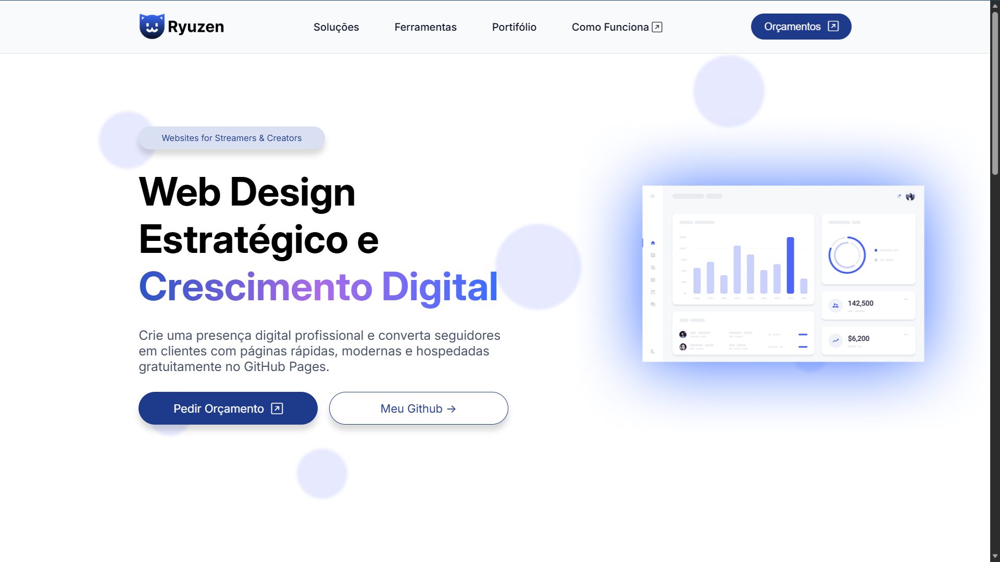

# Ryuzen — Portfólio de Web Design

  

Landing page desenvolvida para apresentar meus serviços de **Web Design Estratégico focado em criadores digitais**, como streamers, youtubers e criadores de conteúdo.

O projeto demonstra minhas habilidades em **design de interfaces, desenvolvimento front-end e publicação de aplicações estáticas utilizando GitHub Pages.**

🌐 **Website publicado:**  
https://ryuzenink-cell.github.io/lp/

---

# Objetivo do Projeto

Este projeto foi criado com três objetivos principais:

• Apresentar meus serviços de web design e criação de landing pages  
• Demonstrar minhas habilidades em **HTML, CSS e JavaScript**  
• Publicar uma landing page profissional usando **GitHub Pages**

A proposta do site é comunicar **valor estratégico**, não apenas estética visual.

---

# Tecnologias Utilizadas

- HTML5
- CSS3
- JavaScript
- Git
- GitHub
- GitHub Pages

---

# Design

Todo o design da interface foi criado por mim no **Figma**, seguindo princípios de:

- UI Design
- Hierarquia visual
- Layout moderno de landing pages
- Conversão orientada a marketing

Ferramenta utilizada:

- Figma

---

# Estrutura do Projeto (em desenvolvimento)

lp  
│  
├── index.html  
├── style.css  
├── script.js  
├── infinity-scroll.js  
│  
└── src/  
(assets do projeto)

---

# Funcionalidades

- Landing page responsiva
- Layout moderno para apresentação de serviços
- Seções de:
  - Soluções
  - Portfólio
  - Como funciona
  - Preços
  - Contato
- Scroll infinito para elementos visuais
- Deploy automático com GitHub Pages

---

# Deploy

O projeto é publicado utilizando **GitHub Pages**.

Sempre que há um novo push para a branch `main`, o site é atualizado automaticamente.

---

# Autor

**Adrian Rollim Santos**

Estudante de Administração e Engenharia de Software  
Interessado em desenvolvimento web, design digital e criação de produtos digitais.

GitHub:  
https://github.com/ryuzenink-cell

---

# Licença

Este projeto foi criado para fins de **portfólio e demonstração técnica**.
